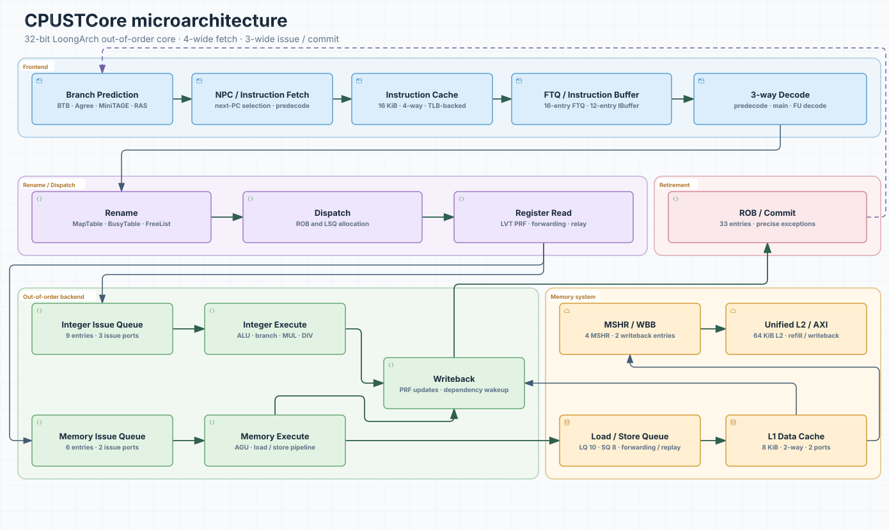

<div align="center">

# CPUSTCore

**A 32-bit out-of-order LoongArch core designed for FPGA implementation**

[](https://github.com/CPUSTCPU/CPUSTCore/actions/workflows/test.yml)
[](https://www.chisel-lang.org/)
[](https://www.scala-lang.org/)

[Chinese](README.md)

</div>

CPUSTCore is a synthesizable 32-bit out-of-order LoongArch processor written
in Chisel. The repository contains the processor source, ChipLab integration
and simulation tops, and focused Chisel tests.

Design resources: [design report](docs/design.pdf) · [editable architecture diagram](docs/drawio/CPUSTCore.drawio)

## Highlights

| | |
| --- | --- |
| **Wide out-of-order backend** | Three integer and two memory issue ports, a 33-entry ROB, branch recovery, and precise exceptions. |
| **Layered branch prediction** | A 2-way BTB and 2048-entry Agree predictor provide the fast path; four 512-entry MiniTAGE tables capture longer history. |
| **Non-blocking memory system** | Load replay, store forwarding, four MSHRs, two writeback buffers, and an optional unified L2 decouple misses from the pipeline. |
| **FPGA-oriented storage** | An LVT physical register file, banked queues, and Xilinx RAM wrappers reduce the cost of multi-port storage and high-fanout paths. |

## Default Configuration

| Item | Configuration |
| --- | --- |
| ISA / datapath | 32-bit LoongArch / 32-bit integer datapath |
| Fetch / decode / commit | 4 / 3 / 3 instructions per cycle |
| Issue | 3 integer + 2 memory ports |
| ROB / physical registers | 33 / 64 entries |
| IntIQ / MemIQ | 9 / 6 entries |
| Load Queue / Store Queue | 10 / 8 entries |
| Branch prediction | 2-way BTB, 2048-entry Agree, 4 x 512-entry MiniTAGE, 8-entry RAS |
| L1 instruction cache | 16 KiB, 4-way, 64-byte lines |
| L1 data cache | 8 KiB, 2-way, two request ports, 64-byte lines |
| L2 cache | 64 KiB, 4-way by default; optional at elaboration time |

The authoritative definitions are in
[`Parameters.scala`](src/main/scala/Config/Parameters.scala) and
[`MemoryConfig.scala`](src/main/scala/MemorySystem/MemoryConfig.scala).

## Architecture



Archify source: [architecture.json](docs/architecture.json). Detailed diagram: [CPUSTCore.drawio](docs/drawio/CPUSTCore.drawio).

## Quick Start

### Requirements

- JDK 17 or newer
- sbt 1.12.9, pinned by [`project/build.properties`](project/build.properties)
- Access to Maven repositories for the first build
- Vivado 2023.2 for FPGA synthesis, implementation, and ChipLab integration

The project uses Chisel 6.7.0 and Scala 2.13.16. See [`build.sbt`](build.sbt)
for the complete dependency list.

### Clone and Test

```bash
git clone https://github.com/CPUSTCPU/CPUSTCore.git
cd CPUSTCore
sbt --no-colors test
```

The focused tests cover branch prediction, memory replay and flush behavior,
MSHR merging, ICache/TLB response pairing, and load recovery.

## Repository Layout

```text
.
|-- src/main/scala/
|   |-- Backend/              # Rename, issue, execute, ROB, and writeback
|   |-- Frontend/             # IFU, FTQ, instruction buffer, and predictors
|   |-- MemorySystem/         # Caches, LSQ, TLB, MSHRs, and bus interfaces
|   |-- Decode/               # Predecode, main decode, and FU decode
|   |-- Config/               # Core parameters and shared hardware helpers
|   `-- Utils/                # Queues, RAMs, and FPGA wrappers
|-- src/test/scala/           # Focused Chisel tests
|-- docs/
|   |-- architecture.svg       # Architecture overview for GitHub
|   |-- architecture.json      # Archify diagram source
|   |-- drawio/               # Editable architecture diagrams
|   |   `-- CPUSTCore.drawio
|   `-- design.pdf            # Design report
```

Physical directories follow the microarchitecture. Scala sources use the
common `CPUSTC.*` top-level package.

## FPGA and ChipLab Scope

The complete ChipLab functional, performance, implementation, and bitstream
flow depends on an external ChipLab project and is not included here.
